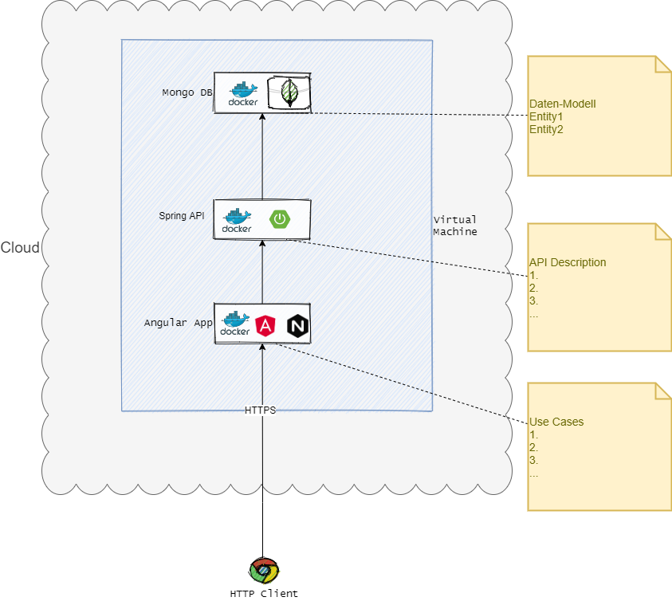

# Vaccination certificate

<h2> Architiecture </h2>

<h2> Requirements </h2>

<h2> How to run the project </h2>
1. Clone the repo locally `git clone https://github.com/devopsusr-tech/hackerearth2021.git`
2. Go to root of the project
3. Run `docker-composer up`
4. It will be run on http://localhost

<h2> How to setup Backend </h2>
1. ...

<h2> How to setup Frontend </h2>
[Guidelines for setuo the frontend](frontend/vaccathon/README.md)

<h2> License </h2>

