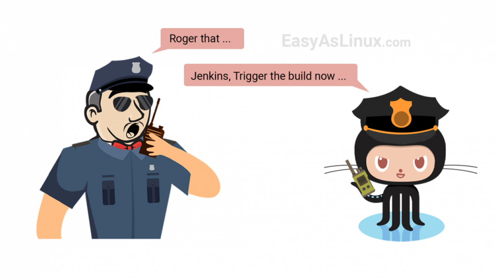

<h1>Vaccathon</h1>

<h2> Architiecture </h2>

  

<h2> How to run the project </h2>

  1. Clone the repo locally `git clone https://github.com/devopsusr-tech/hackerearth2021.git`
  2. Go to root of the project
  3. Run `docker-composer up`
  4. It will be run on http://localhost

  <h2> Requirements to develop </h2>
  
  - Docker
  - Java 11
  - Apache Maven 3.6
  - npm 6
  - Node 14
  - Angular CLI 11

  <h2> How to setup Backend </h2>
    
    1. Clone the repo locally `git clone https://github.com/devopsusr-tech/hackerearth2021.git`
    2. Open the project in intelliJ    
    3. Project structure > Project > Project SDK > You have to set your java path here (Java version >11)    
    4. Project structure > Modules > Click Sources > Set src folder as Source
    5. Update maven dependencies
      Settings/Preferences > Build, Execution, Deployment > Build Tools > Maven > Repositories > click Update
    6. Maven clean and install    
    7. Build backend docker container after changes
      - Go to backend directory
      - `docker build -t lulzimbulica/vaccathon-backend .`
    8. If you get an error message "/bin/sh: 1: ./mvnw: not found"
      - Go to backend directory
      - Run `mvn -N io.takari:maven:wrapper`

  <h2> How to setup Frontend </h2>
  <a href="frontend/vaccathon/README.md">
    Guidelines for setup the frontend
  </a>

  

  <h2> Continuous Integration </h2>
    This project is supplied by a Continuous Integration (CI) pipeline. Whenever a push / merged pull request occurs in the main branch, a Jenkins CI pipeline is triggered.
  </a>
   
  

The <a href="http://3.120.176.45:8080/">Jenkins pipeline</a> will be able to push the latest changes in the running production envrionment. Before deploying the changes the newest code should pass the quality gates such as static code quality, unit tests and builds. If the new code passes these blocks, with the manual approve of the user, the newest code will be packaged in docker containers and deployed to the runinng environment.

<h2> License </h2>

